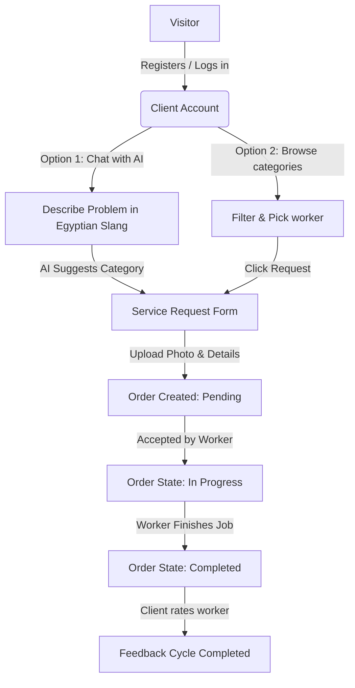
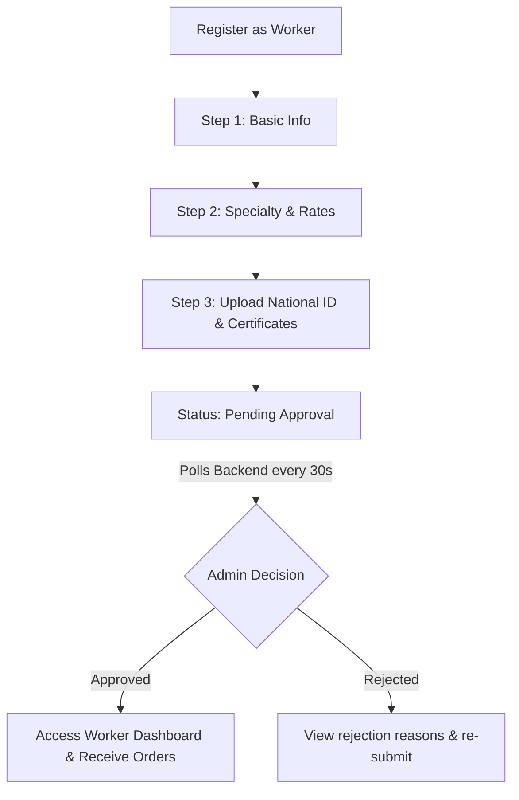

# 🛠️ OstaFinder — User & Worker Application

> **Egyptian Home Services Marketplace** — An elegant, high-performance web platform that bridges the trust gap between homeowners ("Clients") and verified skilled technicians ("Ostas" / "Sana'eyah") for home maintenance, repair, and installations.

---

<div align="center">
  
  [](https://react.dev)
  [](https://vite.dev)
  [](https://tailwindcss.com)
  [](https://redux-toolkit.js.org)
  [](https://reactrouter.com)
  [](https://motion.dev)

</div>

---

## 📖 Table of Contents

- [✨ Core Features](#-core-features)
  - [Client Experience](#client-experience)
  - [Worker Experience](#worker-experience)
  - [AI Smart Diagnosis](#ai-smart-diagnosis)
- [🎨 Design System & Aesthetics](#-design-system--aesthetics)
- [🛠️ Tech Stack](#️-tech-stack)
- [📁 Folder Structure](#-folder-structure)
- [🔀 User Flows](#-user-flows)
- [⚙️ Getting Started](#️-getting-started)
- [🌐 Deployment](#-deployment)

---

## ✨ Core Features

The User Frontend is built with a **Desktop-First (Web)** approach, catering to detailed task configuration and verification workflows. 

### Client Experience
*   **Sticky Glassmorphism Navigation:** Instant access to services, booking tabs, and profile settings.
*   **Intuitive Category Browsing:** Responsive sliders and grid views for categories (Plumbing, Electrical, Carpentry, AC Repair, Painting, etc.).
*   **Advanced Worker Filters:** Browse Ostas by category, price range, rating score, and search keywords with pagination.
*   **Multi-step Booking Engine:** Book technicians with detailed descriptions, date/time scheduling, location details, urgency levels, and image uploads.
*   **Order Tracking Hub:** A dashboard showing active and past requests with categorized tabs (Pending, In Progress, Completed, Cancelled) and dynamic statuses translated into Egyptian Arabic.
*   **Double-Loop Feedback:** Clients rate technicians (1-5 stars) and write text reviews upon project completion.

### Worker Experience
*   **3-Step Onboarding Wizard:**
    1.  *Basic Profile Information:* Full name, email, phone number, and address.
    2.  *Professional Profile:* Category selection, years of experience, hourly/service rates, and biography.
    3.  *Trust Documentation:* Secure file uploads for National ID card (Front & Back) and professional certification papers.
*   **Polling-based Approval State:** A dynamic landing screen that polls the backend every 30 seconds to automatically guide the worker to their dashboard once an administrator approves their profile.
*   **Worker Analytics Dashboard:** Real-time stats cards tracking total orders, acceptance/employment rates, and monthly earnings.
*   **Service & Portfolio Builder:** Full CRUD capabilities for Ostas to manage their offered services and showcase portfolios of previous works (distinguishing between platform jobs and offline projects).
*   **Incoming Requests Feed:** Quick-action cards displaying client location, budget, problem descriptions, and urgent tags with one-click "Accept" or "Reject" choices.

### AI Smart Diagnosis
*   **OpenAI-Powered Assistant:** Integrates a client-side chat widget where users can describe their home repair issues in plain Egyptian slang (e.g., "الحنفية بتنقط مية" or "التكييف مش بيسقع").
*   **Smart Recommendation:** The AI analyzes the problem, categorizes it (e.g., Plumbing, Air Conditioning), and suggests appropriate Ostas, reducing friction in order creation.

---

## 🎨 Design System & Aesthetics

OstaFinder's UI is designed with a premium, tactile, and professional aesthetic based on **Trust Architecture**.

### Color Tokens
*   **Primary (Electric Blue):** `#2563EB` — Power, authority, trust, and branding.
*   **Secondary (Golden Amber):** `#F59E0B` — Highlights, stars, tips, and urgency.
*   **Success (Emerald):** `#10B981` — Completed orders, verified badges, active states.
*   **Warning (Sunset Orange):** `#F59E0B` — Pending notifications and verification flags.
*   **Error (Crimson):** `#EF4444` — Cancellations, errors, and risk actions.
*   **Background (Cool Slate/Gray):** `#F8FAFC` & `#FFFFFF` — Modern, high-contrast surface levels.

### Typography & Layout
*   **Font Family:** `Cairo` (Google Fonts) — Beautifully optimized for Arabic characters across all weight variants (Regular, Medium, SemiBold, Bold).
*   **RTL Optimization:** Fully supports right-to-left layout alignment for Arabic native speakers.
*   **Visual Style:** Built using a mixture of **Flat Minimalist Surfaces**, **Glassmorphic Navigation Bar** (backdrop-filter blur), and **Claymorphic Call-to-Actions** (soft inner-shadows for main buttons).

---

## 🛠️ Tech Stack

*   **Core:** React 19 (Functional components, hooks, custom states)
*   **Bundler:** Vite 8.x (Lightning-fast HMR and build optimizations)
*   **Styling:** Tailwind CSS v4.0 (Utilizes new CSS-based configuration and `@tailwindcss/vite` compiler)
*   **Routing:** React Router v7 (Handles page guards and nested layouts)
*   **State Management:** Redux Toolkit (Slices for local authentication, onboarding steps, and chat sessions)
*   **Network Requests:** RTK Query (Caching, automated re-fetching, global base configurations with custom error middleware)
*   **Animations:** Motion (Framer Motion) (Liquid-smooth tab transitions, fade-ins, and modal micro-animations)
*   **Slider Carousel:** Swiper 12.x (Responsive touch-enabled sliding components)
*   **Form Validation:** Joi (Validates worker registration and booking details client-side)
*   **Feedback & Modals:** @headlessui/react (Accessible, unstyled components for dialogs) & React Toastify (Notifications)

---

## 📁 Folder Structure

```
OstaFinder-User-Frontend/
├── public/                 # Static assets (images, logos)
├── src/
│   ├── main.jsx            # Entry point
│   ├── App.jsx             # Root layout & routing configuration
│   ├── index.css           # Global Tailwind directives & styling overrides
│   │
│   ├── routes/
│   │   ├── AppRoutes.jsx   # Client, Worker, and Guest routing maps
│   │   └── guards/
│   │       ├── AuthGuard.jsx     # Rejects unauthenticated users
│   │       ├── GuestGuard.jsx    # Redirects logged-in users away from auth pages
│   │       ├── ClientGuard.jsx   # Restricts access to client-only pages
│   │       └── WorkerGuard.jsx   # Restricts access to onboarded/approved workers
│   │
│   ├── store/
│   │   ├── index.js              # Redux configureStore
│   │   └── slices/
│   │       ├── authSlice.js      # Authentication states (user, role, token)
│   │       ├── onboardingSlice.js # Multiphase worker registration state
│   │       └── chatSlice.js      # Temporary messages cache for the AI chat
│   │
│   ├── services/
│   │   ├── apiSlice.js           # Base RTK Query slice
│   │   ├── customBaseQuery.js    # Fetch base wrapper with auto JWT token refresh
│   │   ├── authApi.js            # Login / Register endpoints
│   │   ├── workerApi.js          # Onboarding submission & status queries
│   │   ├── orderApi.js           # Request creations & updates
│   │   └── aiApi.js              # OpenAI diagnostics session
│   │
│   ├── layouts/
│   │   ├── MainLayout.jsx        # Navbar + Footer + Sticky AI widget wrapper
│   │   ├── WorkerLayout.jsx      # Worker dashboard layout with sidebar
│   │   └── PageContainer.jsx     # Centered spacing wrapper
│   │
│   ├── components/
│   │   └── layout/
│   │       ├── Navbar.jsx        # Sticky backdrop-blur navigation
│   │       └── Footer.jsx        # Desktop footer
│   │
│   └── features/
│       ├── public/pages/         # LandingPage, AboutUs, Terms, Privacy, FAQ
│       ├── auth/pages/           # Login, Register
│       ├── client/pages/         # ClientHome, Categories, createOrderPage, ClientRequests
│       └── worker/pages/         # WorkerDashboard, WorkerOnboarding, IncomingRequests, portfolio
```

---

## 🔀 User Flows

The core system handles two major user pathways:

### Client Booking & Diagnostic Flow


### Worker Approval Flow


---

## ⚙️ Getting Started

### Prerequisites
Make sure you have [Node.js](https://nodejs.org/) installed (v18.x or above recommended) along with `npm`.

### Installation
1. Navigate to the project directory:
   ```bash
   cd OstaFinder-User-Frontend
   ```
2. Install dependencies:
   ```bash
   npm install
   ```

### Configuration
Create a `.env` file in the root of the frontend folder:
```env
# Backend API Base URL
VITE_API_URL=http://localhost:8000

# Environment Mode
VITE_ENV=development
```

### Running Locally
To launch the Vite development server:
```bash
npm run dev
```
Open your browser and navigate to `http://localhost:5173`.

### Building for Production
To bundle the application for production deployment:
```bash
npm run build
```
The compiled static assets will be output to the `dist/` directory.

### Linting
To check and format files with ESLint:
```bash
npm run lint
```

---

## 🌐 Deployment

The application is configured to deploy effortlessly on cloud platforms like **Vercel** or **Netlify**:
1. Connect the repository to your provider.
2. Set the build command to `npm run build`.
3. Set the output directory to `dist`.
4. Configure environment variables in the provider dashboard (`VITE_API_URL`).
